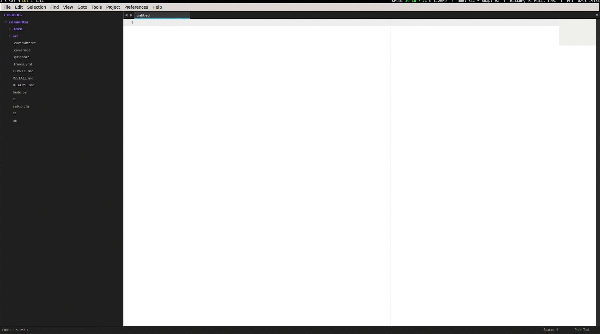

EasyPyb
=======

Sublime text 3 plugin for [PyBuilder](http://pybuilder.github.io).



## Features
* Real-time output
* Minimal configuration if you use Anaconda or SublimePythonIDE as it reuses the settings
* Does not block so you can work or check out what to do next while building.

## Installation
Clone it in your sublime text `Packages/` directory.

## Usage
The command `EasyPyb : Run PyBuilder` will be made available to you through the command palette. Activating it will run PyBuilder on your project.

## Configuration
EasyPyb expects two project settings to be present:

* `python_interpreter`
  This is the path to your python interpreter. Could be your system python or a virtualenv.
* `project_root`
  The root of your project where the build descriptor (`build.py`) is located.

Here's what your project settings might look like :

```
{
    "folders":
    [
        {
            "follow_symlinks": true,
            "path": "/home/mriehl/workspace/yadtshell"
        }
    ],
    "settings":
    {
        "python_interpreter": "/home/mriehl/workspace/yadtshell/venv/bin/python",
        "project_root": "/home/mriehl/workspace/yadtshell"
    }
}
```

## License
[MIT](https://github.com/mriehl/EasyPyb/blob/master/LICENSE)
